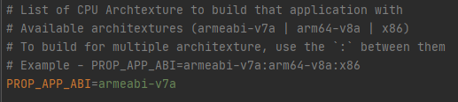
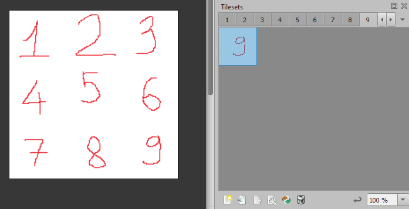

# MyRollBall

- [MyRollBall](#myrollball)
  - [1. Create solution in proj.win32 folder using cmake](#1-create-solution-in-projwin32-folder-using-cmake)
  - [2. Add a new class to CMakeLists.txt](#2-add-a-new-class-to-cmakeliststxt)
  - [3. Replace GAME_SOURCE in `CMakeLists.txt` by content of `fileCpp.txt`](#3-replace-game_source-in-cmakeliststxt-by-content-of-filecpptxt)
  - [4. Replace GAME_HEADER in `CMakeLists.txt` by content of `fileh.txt`](#4-replace-game_header-in-cmakeliststxt-by-content-of-filehtxt)
  - [5. Change cmake version in `Android Studio`](#5-change-cmake-version-in-android-studio)
  - [6. Change CPU Archtexture](#6-change-cpu-archtexture)
  - [7. Change build type](#7-change-build-type)
  - [8. Unordered_map](#8-unordered_map)
  - [9. Black screen on loading tiledmap when the game is run on Android](#9-black-screen-on-loading-tiledmap-when-the-game-is-run-on-android)
  - [10. Each layer in `Tiled` editor just has only a tileset](#10-each-layer-in-tiled-editor-just-has-only-a-tileset)
  - [11. Loading tiledmap can be wrong position if choosing `tile layer format` is `CSV`](#11-loading-tiledmap-can-be-wrong-position-if-choosing-tile-layer-format-is-csv)

In the project, All tools version we have used:
| cocos2d-x | tiledmap | android studio | gradle | ndk          | cmake  | Visual Studio Community 2019 |
| --------- | -------- | -------------- | ------ | ------------ | ------ | ---------------------------- |
| 4.0       | 1.6      | 4.2            | 5.6.2  | 21.1.6352462 | 3.10.2 | Version 16.10.0              |

## 1. Create solution in proj.win32 folder using cmake

In `proj.win32`
```
cmake .. -G "Visual Studio 16 2019" -AWin32
```

Enter `MyRollBall.sln`, Remove `ALL_BUILD` Project. Run it

## 2. Add a new class to CMakeLists.txt

Run `tools/list-cpp-h-files.bat`

In `fileCpp.txt`
```
AppDelegate.cpp
HelloWorldScene.cpp
```

In `fileh.txt`
```
AppDelegate.h
HelloWorldScene.h
```

## 3. Replace GAME_SOURCE in `CMakeLists.txt` by content of `fileCpp.txt`

  ```
    list(APPEND GAME_SOURCE
         Classes/*.cpp
         )
  ```
  to
  ```
  list(APPEND GAME_SOURCE
       Classes/AppDelegate.cpp
       Classes/HelloWorldScene.cpp
       )
  ```

## 4. Replace GAME_HEADER in `CMakeLists.txt` by content of `fileh.txt`

```
    list(APPEND GAME_HEADER
         Classes/*.h
         )
  ```
  to
  ```
  list(APPEND GAME_HEADER
       Classes/AppDelegate.h
       Classes/HelloWorldScene.h
       )
  ```

## 5. Change cmake version in `Android Studio`
In `build.gradle (Module: proj.android.MyRollBall)`, Add `version: 3.10.2` line as the below image


## 6. Change CPU Archtexture
In `gradle.properties`, Follow the comnent


## 7. Change build type
In `gradle.properties`, Follow the comnent


## 8. Unordered_map

This issue will only occurs on android If using `unordered_map` without defining hasher


```
In file included from C:\Users\tensa\AppData\Local\Android\Sdk\ndk\21.1.6352462\toolchains\llvm\prebuilt\windows-x86_64\sysroot\usr\include\c++\v1\unordered_map:409:
In file included from C:\Users\tensa\AppData\Local\Android\Sdk\ndk\21.1.6352462\toolchains\llvm\prebuilt\windows-x86_64\sysroot\usr\include\c++\v1\__hash_table:15:
In file included from C:\Users\tensa\AppData\Local\Android\Sdk\ndk\21.1.6352462\toolchains\llvm\prebuilt\windows-x86_64\sysroot\usr\include\c++\v1\memory:652:
C:\Users\tensa\AppData\Local\Android\Sdk\ndk\21.1.6352462\toolchains\llvm\prebuilt\windows-x86_64\sysroot\usr\include\c++\v1\type_traits:1527:38: error: implicit instantiation of undefined template 'std::__ndk1::hash<cocos2d::EventKeyboard::KeyCode>'
```

We can fix like this
```
struct StringHasher {
    size_t operator()(const cocos2d::EventKeyboard::KeyCode& t) const {
        return (size_t) t;
    }
};

std::unordered_map<cocos2d::EventKeyboard::KeyCode, bool, StringHasher> pressingKeys;
```

## 9. Black screen on loading tiledmap when the game is run on Android

I setup `Assets` and `Levels` folder like this
 


I fixed it like this
  


In others words, `Assets` folder we use must be child of `Levels` folder

## 10. Each layer in `Tiled` editor just has only a tileset

If The layer uses many tilesets like this:


and `cocos2d::TMXTiledMap` or `cocos2d::FastTMXTiledMap` is used in C++, we will have:


**How to fix it?** It is easy to fix: "one layer one tileset"

## 11. Loading tiledmap can be wrong position if choosing `tile layer format` is `CSV`

On Android, We got:


Testing on all `tile layer format`

| Format                       | Result |
| ---------------------------- | ------ |
| XML                          | pass   |
| Base64(uncompressed)         | pass   |
| Base64(gzip compressed)      | pass   |
| Base64(zlib compressed)      | pass   |
| Base64(Zstandard compressed) | fail   |
| CSV                          | fail   |
